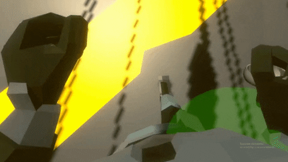

# Grapple VR
Multiplayer VR Shooting Game
# Features
- Full VR body!  
  
  
- Grappling Gun Movement!  
  
- Free-For-All Gamemode!  
  

# Story
For the final project in the AR/VR specialization at Holberton School we had the freedom to create any type of AR/VR game we wanted. I decided that I wanted to create a game that incorporated a full VR body, a movement mechanic that feels good while standing still, all with multiplayer support. Many VR games use floating hand models, which does a pretty good job of giving you a presence in the virtual world, but is significantly less immersive than having a full body. I was able to acheive this by using Unitys Inverse Kinematics system and the Animation Rigging package. To solve the VR movement problem I created a grappling gun, allowing the player to quickly and easily move around the map in a way that makes sense while standing still in real life. For the multiplayer implementation I used the Photon Bolt engine.
# Download
[Download](https://drive.google.com/file/d/1aP11bYLZU9l5s0-0v8Wu7QTjf8ZO0X-s/view?usp=sharing "Download")
# Usage
Because paid assets were used in this project this repo contains an incomplete version of the game.  
How to play:
- Download GrappleVR.zip
- Unzip
- Open GrappleVR.exe
- Click to start server or join as client
- Have fun!

# Author
Danny Hollman [GitHub](https://github.com/dannyhollman "GitHub") [LinkedIn](https://www.linkedin.com/in/dannyhollman/ "LinkedIn") [Twitter](https://twitter.com/danny_hollman "Twitter")
